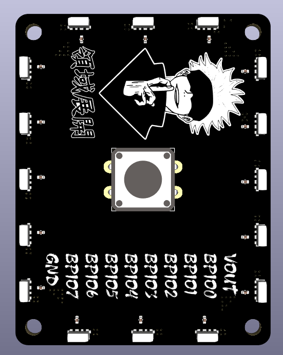
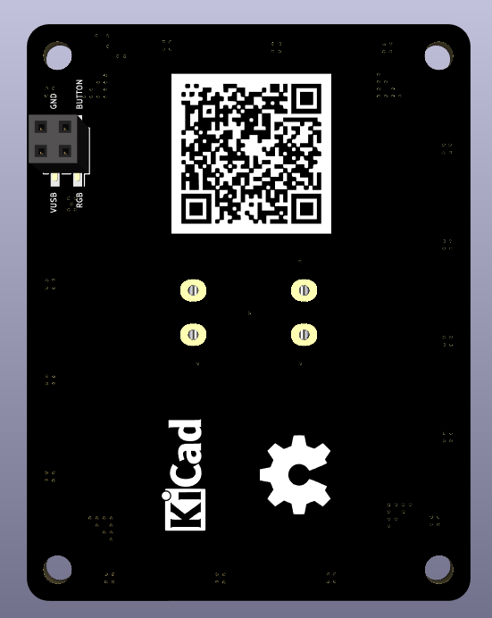

# RB-Pirate RGB & Button HAT

**Optional RGB lighting and physical-button expansion for RB-Pirate**

RB-Pirate RGB & Button HAT adds programmable RGB visual feedback and a physical
user button to the [RB-Pirate](https://github.com/reza-bakhshi/RB-Pirate)
hardware debugging tool. It enables status lighting, animations, button-based
mode control, and scriptable user input through the RB-Pirate firmware.

The HAT is completely optional. RB-Pirate remains fully functional without it,
so the expansion can be installed only when visual feedback or a physical
button is useful.

## PCB gallery

<table>
  <tr>
    <th width="50%">Top</th>
    <th width="50%">Bottom</th>
  </tr>
  <tr>
    <td></td>
    <td></td>
  </tr>
</table>

## Hardware features

- 16 individually addressable SK6812 RGB LEDs arranged around the board
- Side-facing LEDs for perimeter lighting and visual effects
- One 100 nF local decoupling capacitor for each RGB LED
- Large central momentary push button
- Dedicated RGB data and button signals
- Compact four-pin, 2.54 mm SMD connection to RB-Pirate
- Four mounting holes for mechanical alignment
- Two-layer, 1.6 mm PCB
- KiCad 10 schematic and PCB design files

## Firmware features

When used with the
[custom RB-Pirate firmware](https://github.com/reza-bakhshi/RB-Pirate-Firmware),
the HAT provides:

- RGB status indication
- Startup and activity animations
- Introduction and party-mode effects
- Physical escape and mode-control input
- Scriptable button input for automation and custom workflows

## Connector pinout

The HAT connects to RB-Pirate through connector **J1**.

| Pin | Signal | Description |
|:---:|---|---|
| 1 | RGB_IN | Serial data input for the SK6812 LED chain |
| 2 | BUTTON | User-button signal to RB-Pirate |
| 3 | VDD / VUSB | Power input for the HAT |
| 4 | GND | Ground |

> [!NOTE]
> Power off RB-Pirate before installing or removing the HAT. Check connector
> orientation and pin alignment before applying power.

## Related projects

- [RB-Pirate hardware](https://github.com/reza-bakhshi/RB-Pirate)
- [RB-Pirate firmware](https://github.com/reza-bakhshi/RB-Pirate-Firmware)

## License

This project is released under the [MIT License](LICENSE).

Third-party symbols, footprints, models, and other bundled resources remain
subject to their respective licenses.

---

  Optional light and button control for the RB-Pirate ecosystem.

